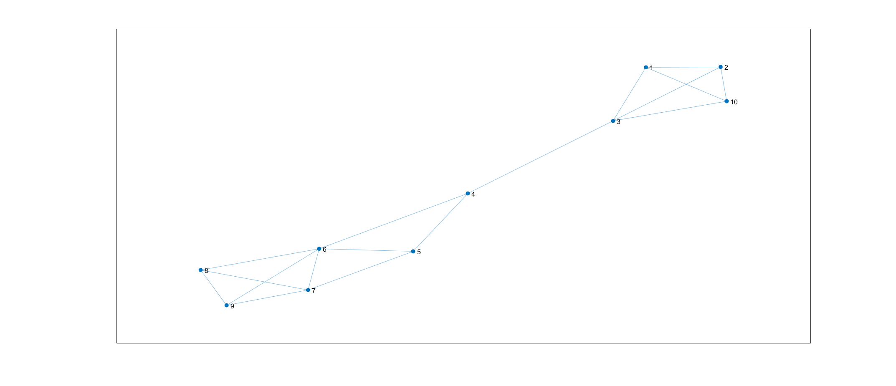
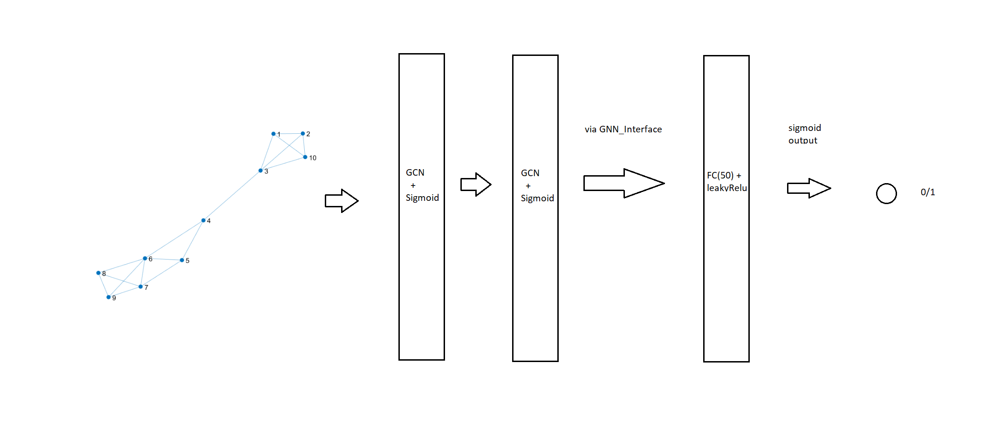

# Graph Classification using GCN


v0.5


TL;DR : **Graph Classification proof-of-concept example**


This simple example demonstrates a custom implementation of GCN (graph Convolution network) for graph level classification task. We have used PROTEINS dataset here (or rather a subset of it)


Dataset ref: https://ls11-www.cs.tu-dortmund.de/staff/morris/graphkerneldatasets


Graph Classification is a more non-trivial task compared to node-classification as the input graph could have different sizes. This issues is mitigated to some extent by padding


Requirement: MATLAB R2021a+


# Loading in Data


First things first, let us load in our PROTIENS dataset. This loads it adjaceny matrix ('adj'), the node-features ('feat'), the lables ('label') and unmodified adjaceny matrices for plotting ('old_adj')


```matlab:Code
load data.mat
rng(42,'twister');
%Test set creation and shuffling
shuff = randperm(871);
test_set=shuff(end-100:end);
shuff = shuff(1:end-100);
```


I am only using a sub-set of PROTEINS dataset. A challenging issue for graph classification is that that the size of graphs can vary. To counter this I have used padding. The network takes in graphs of fixed size(50). All graphs that have nodes < 50 have been padded with 0. This results in arond 871 graphs. I set 100 of these aside for test. This pre-processed data is stored in data.mat file


## About the dataset


PROTEINS is a dataset of proteins that are classified as enzymes or non-enzymes. Nodes represent the amino acids and two nodes are connected by an edge if they are less than 6 Angstroms apart. The node features are 1 dimensional (atmoic weights).


**Advanced Aside**: The protein_load() function can be modified to specify the number of graph and their sizes. One alternate is to have a network with multiple different heads to process graphs of different sizes with pooling. The protein_load function also pre-processes the adjacency matrix according to graph convolution operation. Check it out for more advanced modifications.


# Visualization


Let us try to visualize an entry. We plot the 3rd protein example using its adjacency matrix


```matlab:Code
GNN_viz(3,old_adj)
```




  
# Designing the Network


We will create a simple classification network with two GCN layers (two accumators) and a fully connected layer. 


GCN = Graph Conv layer (needs weight size as input)


GNN_interface = This layer is needed at the end of GCN layers to provide interface for rest of the network.


Network architecture


```matlab:Code
imshow('arch.png')
```





Input +> GCN -> GCN -> GNN_interface -> FC(30) -> FC(1)


```matlab:Code
layer1 = GCN([1,2],'firstGCN');
layer2 = GCN([2,1],'secondGCN');
layer3 = GNN_interface(50,'final');
layer4 = fullyConnectedLayer(30,'Name','fc1');
layer5 = fullyConnectedLayer(1,'Name','fc2');
act1 = leakyReluLayer(0.05,'Name','lr');
act2 = sigmoidLayer('Name','ss');
my_net = [layer1,layer2,layer3,layer4,act1,layer5,act2];
```


Now we connect the layers and create a 'dlnetwork' object


```matlab:Code
Adja = dlarray(ones(50),'CU');
feata = dlarray(ones([50,1]),'C');
lgraph = layerGraph();
lgraph = addLayers(lgraph,my_net);
lgraph = connectLayers(lgraph,"firstGCN/out2","secondGCN/in2");
lgraph = connectLayers(lgraph,"secondGCN/out2","final/in2");
%create a dlnetwork with sample input
my_net = dlnetwork(lgraph,Adja,feata);

```


Lets plot out our graph


```matlab:Code
plot(lgraph)
```


  
# **Network Training**


We first set the hyperparameters for training out network


```matlab:Code
train_len = length(shuff)
```


```text:Output
train_len = 771
```


```matlab:Code
epochs = 20
```


```text:Output
epochs = 20
```


```matlab:Code
learnRate = 0.01;
momentum = 0.90;
vel = [];
```


Let the training begin,


```matlab:Code
for j=1:epochs
losstot=0;
for i=1:train_len
    var1=dlarray(adj{shuff(i)},'CU');
    var2=dlarray(feat{shuff(i)},'C');
    var3=dlarray(label(shuff(i))-1,'CB');
    [grad,los]=dlfeval(@GNN_Gradients,my_net,var1,var2,var3);
    losstot = losstot + los;
    [my_net,vel] = sgdmupdate(my_net,grad,vel,learnRate,momentum);
end   
disp(['Total error for epoch ',num2str(j),' is : ',num2str(losstot)])
end
```


```text:Output
Total error for epoch 1 is : 538.222
Total error for epoch 2 is : 537.4161
Total error for epoch 3 is : 537.3239
Total error for epoch 4 is : 537.2693
Total error for epoch 5 is : 537.2325
Total error for epoch 6 is : 537.1979
Total error for epoch 7 is : 537.1571
Total error for epoch 8 is : 537.2739
Total error for epoch 9 is : 537.0533
Total error for epoch 10 is : 536.9518
Total error for epoch 11 is : 536.7803
Total error for epoch 12 is : 536.6064
Total error for epoch 13 is : 535.8696
Total error for epoch 14 is : 534.3651
Total error for epoch 15 is : 522.2236
Total error for epoch 16 is : 483.946
Total error for epoch 17 is : 477.9955
Total error for epoch 18 is : 475.5043
Total error for epoch 19 is : 472.8711
Total error for epoch 20 is : 470.351
```


Finally we test the accuracy of the network on the 101 graphs we set aside for testing


```matlab:Code
GNN_test(my_net,adj,feat,label,test_set)
```


```text:Output
train_len = 101
ans = 72.2772
```


**Accuracy of 71-72 is not great! but its not bad either considering SOTA is 84% on PROTEINS** and our network was the most basic one and trained only on a subset of graphs. Some future things that I intend to try to increase the accuracy:


1) Graph Batching: We did not have any batching whatsover.


2) Graph Pooling : Pooling operations would be useful in graph classification tasks.


3) Optimizations and network tuning


4) Add gpuArray support


